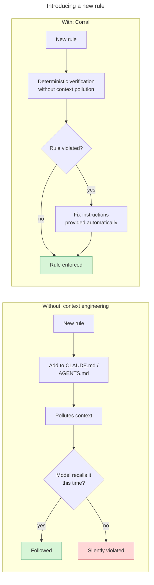

# Corral

**ArchUnit rules that fail in the test loop your coding agent already runs, and tell it how to fix
them.**

A rule in `CLAUDE.md` is followed when the model happens to recall it. A rule in Corral is a test: it
fails deterministically, the failure explains why the rule exists and how to fix it, and violations
that predate the rule are frozen as debt, so you can adopt it on any codebase today.

[](https://github.com/MilczekT1/Corral/actions/workflows/build-java.yml) [](https://sonarcloud.io/summary/new_code?id=MilczekT1_Corral) [](LICENSE) [](pom.xml)

[**Why Corral**](#why-corral) · [**Evidence**](docs/evidence.md) · [**Quick start**](#quick-start) · [**Rules**](docs/rules.md) · [**Write your own**](docs/creating-a-rule.md) · [**Example consumer**](corral-example)



Corral verifies concrete statements, not vague descriptions. *No field injection* is something a
build can decide; *prefer boring solutions* is not, and stays in `CLAUDE.md`.

This is what a failure looks like. The agent reads it in the same test output it was already going
to read, and nothing about the rule occupies its context until then:

```text
Architecture Violation [corral.logging.no-system-out] [Priority: MEDIUM]

WHY:
  A write to System.out bypasses the logging configuration entirely: no level, no logger name, no
  structured context, no appender. It cannot be filtered, routed, shipped to an aggregator or
  silenced […]

HOW TO FIX:
  Log the message through the project's logger, at the level it deserves — log.debug for a trace
  someone enables while investigating, log.info for an event worth keeping […]

HOW NOT TO FIX (this rule):
  Do NOT route the same write through a wrapper to dodge the field match — a PrintStream local, a
  Console helper, a stream fetched reflectively — the output stays just as unmanaged […]

HOW NOT TO FIX (always):
  - Do NOT edit, hand-write, or delete files under archunit/frozen/ to make a NEW violation
    disappear. The store records pre-existing debt only; new violations must be fixed in code.
  - …and nine more…

Offending locations:
  Method <com.example.consumer.service.NoisyService.announce(java.lang.String)> gets field
  <java.lang.System.out> in (NoisyService.java:7)
```

## Why Corral

- **It runs where the agent already looks.** A Corral rule is a JUnit test. It fails in `mvn test`,
  in the IDE gutter, and in CI, with no extra tool to install or remember to run.
- **Every failure carries its own fix.** WHY the rule exists, HOW TO FIX it, and the tempting wrong
  moves, written for whoever reads the failure next — increasingly a coding agent.
- **Adoption never blocks.** Every rule ships frozen: the first run records today's violations as
  debt and passes, only *new* ones fail. Adopt a rule on a codebase that breaks it 200 times, today.
- **It wraps any `ArchRule`.** Rules you already have, or write for your own layers and packages,
  get the same failure format and the same freeze through `corral-sdk`.
- **The cheap ways back to green are named before anyone reaches for one.** Ten clauses in
  [`AntiFixPolicy`](corral-sdk/src/main/java/io/github/milczekt1/corral/format/AntiFixPolicy.java)
  ride on every failure. Two are enforced in code: an `archunit_ignore_patterns.txt` on the classpath
  fails every rule, and an exclusion needs a written reason that is reprinted on every other rule's
  failure for as long as it stands.

## Evidence

Twelve fresh-context coding-agent sessions, three models at two effort levels, were pointed at a
red build with two planted violations and told to make it green. All twelve fixed the code; none
touched the freeze store, the exclusions or the test annotations. Half ran with Corral's failure
format and half with ArchUnit's default output, and the outcome was the same in both halves — what
the guidance changed was *how* they fixed it, not whether. Setup, per-run results and the caveats
that go with a twelve-run sample are in **[docs/evidence.md](docs/evidence.md)**.

## Quick start

**1. Depend on it** — see [Install](#install) for where the artifact comes from today.

```xml
<dependency>
  <groupId>io.github.milczekt1</groupId>
  <artifactId>corral-rules</artifactId>
  <version>0.1.0-SNAPSHOT</version>
  <scope>test</scope>
</dependency>
```

**2. Wire the groups you want** — `src/test/java/com/acme/arch/ProjectArchitectureTest.java`.

```java
import com.tngtech.archunit.core.importer.ImportOption;
import com.tngtech.archunit.junit.AnalyzeClasses;
import com.tngtech.archunit.junit.ArchTest;
import com.tngtech.archunit.junit.ArchTests;
import io.github.milczekt1.corral.groups.LoggingRulesGroup;
import io.github.milczekt1.corral.groups.TestingJunitRulesGroup;
import io.github.milczekt1.corral.groups.TestingRulesGroup;

@AnalyzeClasses(packages = "com.acme", importOptions = ImportOption.DoNotIncludeJars.class)
class ProjectArchitectureTest {

    @ArchTest static final ArchTests testing = ArchTests.in(TestingRulesGroup.class);
    @ArchTest static final ArchTests testingJunit = ArchTests.in(TestingJunitRulesGroup.class);
    @ArchTest static final ArchTests logging = ArchTests.in(LoggingRulesGroup.class);
}
```

> Do **not** add `ImportOption.DoNotIncludeTests`. The testing rules inspect your test classes;
> excluding them makes those rules pass vacuously — green build, zero enforcement.

The result is one JUnit tree: run the class, one group, or a single rule from the IDE gutter. A group
you do not wire is not enforced. Splitting across several test classes is fine — wire each rule from
exactly one of them, since a rule id is a freeze-store key. [`corral-example`](corral-example) is laid
out that way.

**3. Configure ArchUnit** — `src/test/resources/archunit.properties`. Without the second line, none
of the output above is printed.

```properties
freeze.store.default.path=src/test/resources/archunit/frozen
failureDisplayFormat=io.github.milczekt1.corral.format.AgentFriendlyFailureDisplayFormat
```

**4. Seed the freeze store once, then commit it.**

```bash
mvn test -Darchunit.freeze.store.default.allowStoreCreation=true
git add src/test/resources/archunit/frozen && git commit -m "chore: freeze existing violations"
```

Existing violations are now debt; only new ones fail. Two ways to end up green and enforcing nothing:
**not committing the store** (CI sees no entry, re-seeds, and absorbs the first real violation
silently), and **pinning `allowStoreCreation` in `archunit.properties`** instead of passing it once (a
lost store then silently re-freezes everything). Both are covered in
[Configuration](docs/configuration.md).

## Break it yourself

The fastest way to see what an agent sees. In [`corral-example`](corral-example), add a line to any
service:

```java
System.out.println("hello");
```

then run `./mvnw -q test` from that module and read the failure. Delete the line, and it is green
again. The example's own [README](corral-example/README.md#expected-output) walks through what each
part of the output means, and what happens when you try each of the wrong fixes.

## What's in the catalog

Rules ship in groups, one per concern, and you wire the groups you want. The current groups and
every rule in them are in the **[rules catalog](docs/rules.md)** — that table is checked against the
published groups by the build, so it cannot go stale.

Two jars, two jobs. **`corral-sdk`** is the framework: `DocumentedRule`, the failure format, the
freeze store, exclusions. It is small and meant to stay small. **`corral-rules`** is the catalog built
on it, and it is where growth happens — rules that hold for most JVM projects, with a fix worth
spelling out. Rules shaped by *your* project — its layers, packages and names — are written with the
SDK in your own repo, in your own namespace, and get the same failure format and freeze. Depend on the
SDK alone to do only that.

## Docs

| I want to… | Guide |
|---|---|
| See what happened when agents met a Corral failure | [Evidence](docs/evidence.md) |
| See every rule and what it enforces | [Rules catalog](docs/rules.md) |
| Tune freezing, the store and the formatter | [Configuration](docs/configuration.md) |
| Turn off one rule and keep the group | [Excluding a rule](docs/excluding-a-rule.md) |
| Write my own rule, or withdraw an id | [Creating](docs/creating-a-rule.md) · [Retiring](docs/retiring-a-rule.md) |
| Understand freezing: what passes, what fails | [Freezing](docs/freezing.md) |
| See how the pieces wire together | [Architecture](docs/architecture.md) |
| See a real consumer, end to end | [`corral-example`](corral-example) |

## Install

Corral is heading to Maven Central. No release is published yet, so until then build it from source
and depend on the snapshot:

```bash
git clone https://github.com/MilczekT1/Corral.git && cd Corral && ./mvnw -q install -DskipTests
```

That puts `io.github.milczekt1:corral-rules:0.1.0-SNAPSHOT` (and `corral-sdk`) in your local
repository, which is what the quick start's dependency resolves against. The
[release process](docs/release-process.md) describes how versions are cut.

## Contributing

`./mvnw verify`. Java 17 baseline, Lombok on the classpath. Design, the rule-id grammar and what
breaks consumers: **[CONTRIBUTING.md](CONTRIBUTING.md)**. Participation is governed by our
[Code of Conduct](CODE_OF_CONDUCT.md); vulnerabilities go through a
[private advisory](SECURITY.md). Licensed [MIT](LICENSE).
