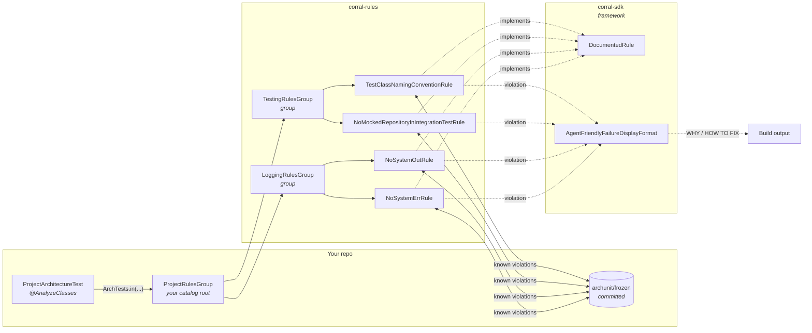
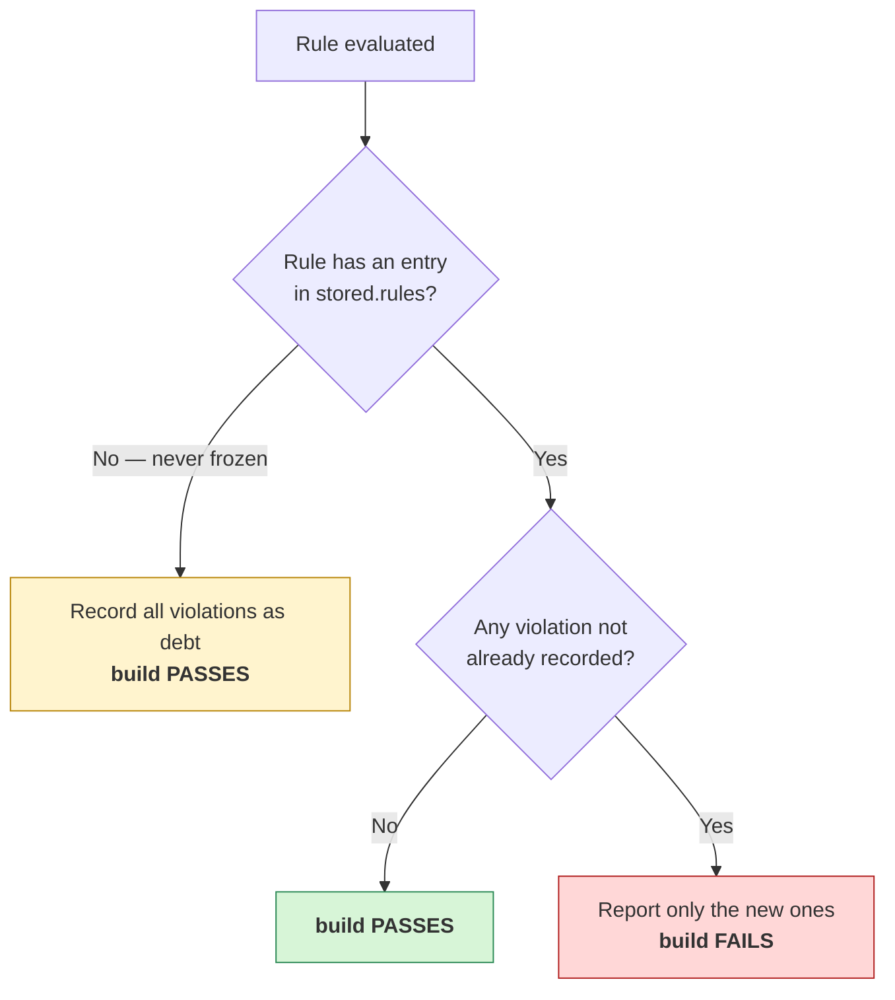

# Corral

[](https://sonarcloud.io/summary/new_code?id=MilczekT1_Corral)

Centralized [ArchUnit](https://www.archunit.org/) rules you write once and enforce everywhere. One
test-scoped dependency, a short list of the groups you want, and your architecture rules stop being
prose in a wiki.

## What you get

| | |
|---|---|
| **Write once, enforce everywhere** | Rules live in this library, not copy-pasted into every repo. Consumers add one dependency and compose the groups they want. |
| **Adoption never blocks** | Every rule is frozen. Existing violations are recorded as debt on first run; only *new* ones fail. You can adopt a rule on a codebase that breaks it 200 times, today. |
| **Failures teach** | A violation prints why the rule exists, how to fix it, and how *not* to fake a fix — written for whoever (or whatever) reads the build log. |
| **Runnable at any granularity** | The wiring produces a real JUnit tree, so you can run the whole suite, one group, or a single rule from the IDE gutter. |
| **Composable** | A rule is a class, a group wraps rules, a group can wrap groups. Nests to any depth. |
| **One rule off, catalog on** | A rule that is wrong for your codebase — not "not yet", but never — goes in `corral-exclusions.txt` with a reason. You keep the group wired, and keep receiving the rules added to it. |
| **You choose what runs** | Wire the groups you want, in your own module. What your build enforces changes when your repo changes, not when the catalog does. |
| **Guarded against silent decay** | The ways this could quietly stop enforcing anything — a rule registered but never evaluated, a group added but never wired — are covered by tests that fail loudly. |

## How it fits together



Each arrow from a group is an `@ArchTest ArchTests` field; each leaf is an `@ArchTest ArchRule`.
Because `ArchTests.in(X)` descends into `X`'s `@ArchTest` fields, the same shape nests indefinitely —
`ProjectRulesGroup` is just a group whose members happen to be groups, and it lives in your repo.

The two jars split by role: `corral-sdk` is the framework for authoring rules, `corral-rules`
is the catalog of rules built on it. Depending on the catalog pulls the framework in transitively;
depend on the SDK alone to write your own rules without adopting these.

## Quick start

**1. Depend on it** (see [Install](#install) for the GitHub Packages repository and auth):

No release is published yet. Cut `0.1.0` via the [Release workflow](docs/release-process.md) first,
then depend on it:

```xml
<dependency>
  <groupId>io.github.milczekt1</groupId>
  <artifactId>corral-rules</artifactId>
  <version>0.1.0</version>
  <scope>test</scope>
</dependency>
```

**2. Compose the groups you want** — `src/test/java/com/acme/arch/ProjectRulesGroup.java`. This is
your catalog root: everything you want run, central groups and your own rules alike, as one node.

```java
package com.acme.arch;

import com.tngtech.archunit.junit.ArchTest;
import com.tngtech.archunit.junit.ArchTests;
import io.github.milczekt1.corral.groups.LoggingRulesGroup;
import io.github.milczekt1.corral.groups.TestingRulesGroup;

/** Every architecture rule this project runs. Add a line to opt into another group. */
final class ProjectRulesGroup {

    @ArchTest
    static final ArchTests testing = ArchTests.in(TestingRulesGroup.class);

    @ArchTest
    static final ArchTests logging = ArchTests.in(LoggingRulesGroup.class);

    // Your own rules go here too — a rule class, or a group of them:
    // @ArchTest static final ArchTests own = ArchTests.in(AcmeRulesGroup.class);

    private ProjectRulesGroup() {
    }
}
```

**3. Add one test class that runs it** — `src/test/java/com/acme/arch/ProjectArchitectureTest.java`:

```java
package com.acme.arch;

import com.tngtech.archunit.core.importer.ImportOption;
import com.tngtech.archunit.junit.AnalyzeClasses;
import com.tngtech.archunit.junit.ArchTest;
import com.tngtech.archunit.junit.ArchTests;

@AnalyzeClasses(packages = "com.acme", importOptions = ImportOption.DoNotIncludeJars.class)
class ProjectArchitectureTest {

    @ArchTest
    static final ArchTests all = ArchTests.in(ProjectRulesGroup.class);
}
```

That is one JUnit tree: run the whole class, one group node, or a single rule leaf from the IDE
gutter. The [rules catalog](docs/rules.md) lists every group you can add a line for; a group left out
is simply not enforced.

> Do **not** add `ImportOption.DoNotIncludeTests`. The testing rules inspect your test classes;
> excluding them makes those rules pass vacuously — green build, zero enforcement.

> Splitting the tree across several test classes is fine and often better — one per concern, each
> with its own `@AnalyzeClasses` scope. Wire each rule from exactly one of them: a rule id is a
> freeze-store key, so the same rule run from two nodes has both writing the same entry.
> `corral-example` is laid out that way.

**4. Configure ArchUnit** — `src/test/resources/archunit.properties`:

```properties
freeze.store.default.path=src/test/resources/archunit/frozen
failureDisplayFormat=io.github.milczekt1.corral.format.AgentFriendlyFailureDisplayFormat
```

> `archunit_ignore_patterns.txt` silently deletes violations before Corral ever sees them, so Corral
> fails the build when that file is on the classpath — add `corral.ignorePatterns.fail=false` to the
> block above if the file is yours and deliberate. Every copy found is named, because ArchUnit reads
> only the first and it may belong to a dependency rather than to you.

**5. Seed the freeze store once, and commit it:**

```bash
mvn test -Darchunit.freeze.store.default.allowStoreCreation=true
git add src/test/resources/archunit/frozen && git commit -m "chore: freeze existing violations"
```

Existing violations are now debt. Only new ones fail.

## What a failure looks like

```text
Architecture Violation [corral.test.class-names-must-end-with-test-or-it] [Priority: MEDIUM]

WHY:
  Most build tools select which top-level classes to run by class-name convention
  (Maven's Surefire and Failsafe plugins, for example, match *Test and *IT
  respectively). A top-level class holding JUnit test methods — @Test,
  @ParameterizedTest, @RepeatedTest, @TestFactory or @TestTemplate — whose name
  ends in neither Test nor IT is silently never executed: it looks like coverage
  in the source tree while proving nothing in CI.

HOW TO FIX:
  Rename the reported top-level class to end in Test (unit tests) or IT
  (integration tests) so your build tool's test-selection convention picks it up…

HOW NOT TO FIX (this rule):
  Do NOT delete the test methods or the class to make this rule pass, and do NOT
  widen your build tool's test-include configuration instead of renaming…

HOW NOT TO FIX (always):
  - Do NOT edit, hand-write, or delete files under archunit/frozen/ to make a NEW
    violation disappear…
  - Do NOT re-run with archunit.freeze.refreeze=true, and do NOT commit
    freeze.store.default.allowStoreCreation=true…
  - Do NOT add to or create archunit_ignore_patterns.txt. ArchUnit discards anything
    matching that file before this rule, the freeze store, or this message ever sees
    it, leaving no record anywhere…
  - Do NOT set corral.ignorePatterns.fail=false to make that check go away. It exists
    to report the file above, so disarming it restores the silence…
  - Do NOT silence the rule with @SuppressWarnings, @ArchIgnore, comments, or by
    disabling the test.
  - corral-exclusions.txt removes a rule from your build permanently, because it does
    not apply to this codebase. It is not a way to pass a failing build…
  - …

Offending locations:
  Class <com.acme.InvalidlyNamedTestClass> does not have simple name ending with 'IT'…
```

The anti-fix policy is appended to **every** failure and cannot be dropped per rule — the point is
that the cheap escape routes are named before someone reaches for one.

`failureDisplayFormat` is global per run, but the formatter falls back to ArchUnit's standard output
for any rule it does not own, so your own ArchUnit tests render unchanged.

## Rules

Four rules today, in two groups — `TestingRulesGroup` and `LoggingRulesGroup`. Wire either, or both,
from your own root. Ids, groups and exactly what each one enforces are in the
**[rules catalog](docs/rules.md)**.

Ids carry a `corral.` vendor prefix and are never renamed, because
[an id is a freeze-store key](docs/rules.md#rule-ids) in every consumer's repo.

## How freezing decides

The single thing worth understanding before you trust the build:



Two consequences follow, and they are the questions people actually ask:

- **A rule added today, violated in three months, fails.** The first run records an index entry (with
  zero violations). Three months later that violation is new, so the build fails. It is *not*
  accepted as debt.
- **Commit the `stored.rules` change** produced by that first run. Uncommitted, CI sees no entry,
  takes the left branch above, and absorbs the first violation silently — a rule that looks armed and
  is not.

> **Changing a rule's predicate invalidates frozen entries for it.** ArchUnit matches known
> violations by their rendered *text*, so widening a rule from `Test`/`IT` to `Test`/`Tests`/`IT`
> rewrites every message it produces — the frozen entries stop matching and the same old violations
> resurface as new ones. That is a breaking change for consumers on the same footing as renaming an
> id: they must re-freeze. Batch predicate changes into a release and say so in the notes.

## Working with rules

Three short guides, one per task:

| I want to… | Guide |
|---|---|
| **Turn off a rule** that is wrong for my codebase | [Excluding a rule](docs/excluding-a-rule.md) |
| **Write a rule** | [Creating a rule](docs/creating-a-rule.md) |
| **Withdraw an id** that was renamed, split or made obsolete | [Retiring a rule](docs/retiring-a-rule.md) |

All three describe the **SDK**, not this catalog. Depend on `corral-sdk` and they work the same way
for a catalog you build for your own company, whether or not you adopt any of Corral's rules — the
steps that apply only to contributing here are called out separately in each guide.

Exclusion is a *consumer* opting out locally; retirement is a *maintainer* withdrawing an id for
everyone. Retirement exists so that a withdrawn id doesn't break the consumers who excluded it.

Excluding takes one line in `src/test/resources/corral-exclusions.txt`:

```text
# <rule-id> :: <reason>
corral.logging.no-system-err :: We ship a CLI; stderr is the interface. ADR-021.
```

You keep the group wired, so rules added to it still arrive on upgrade — you removed one rule, not
the mechanism that delivers them. A reason is mandatory, and every exclusion in effect is printed on
any rule failure. An id that matches no rule in the run logs a warning rather than failing the
build — a typo, or a rule renamed or retired upstream.

> **An exclusion is not a pause button.** An excluded rule records nothing while it is off, so
> violations acquired meanwhile are all *new* the day you delete the line. To adopt a rule you
> currently break, just let it run — freezing records the existing violations as debt.

## Install

The artifact is published to GitHub Packages, which Maven does not know about by default:

```xml
<repositories>
  <repository>
    <id>github</id>
    <name>GitHub Packages</name>
    <url>https://maven.pkg.github.com/MilczekT1/Corral</url>
    <snapshots><enabled>true</enabled></snapshots>
  </repository>
</repositories>
```

GitHub Packages requires authentication even for public reads. Add a matching server to
`~/.m2/settings.xml` — the `<id>` must equal the repository `<id>`:

```xml
<servers>
  <server>
    <id>github</id>
    <username>YOUR_GITHUB_USERNAME</username>
    <password>YOUR_GITHUB_TOKEN</password>  <!-- classic PAT with read:packages -->
  </server>
</servers>
```

Without both pieces the build fails with `Could not find artifact io.github.milczekt1:corral-rules`.
In CI use a secret, not a checked-in token (`${env.GITHUB_TOKEN}` interpolates in `settings.xml`).

Released `x.y.z` versions come from the [Release workflow](docs/release-process.md); snapshots are
published manually from `main` and can be refreshed as often as needed, which makes them the way to
try a change before a release is cut — see
[Snapshots](docs/release-process.md#snapshots).

No release has been cut yet, so `0.1.0` does not resolve until you cut one; publish a snapshot if
you want something to depend on in the meantime.

## Configuration reference

`freeze.store.default.path` is the only required property; the rest are optional, including
`freeze.store`, which swaps in a store that names violation files after the rule id and keeps empty
ones out of your commits. Every setting, and the reason it exists, is in the
**[configuration reference](docs/configuration.md)**.

## Extending

Start with **[Creating a rule](docs/creating-a-rule.md)**. The surrounding design — package layout,
group composition, and what breaks consumers — is in **[CONTRIBUTING.md](CONTRIBUTING.md)**:

- [The shape](CONTRIBUTING.md#the-shape) — one rule one class, and which package owns what
- [Rule ids](CONTRIBUTING.md#rule-ids) — the grammar, and why it is split across two layers
- [A rule in more than one group](CONTRIBUTING.md#a-rule-in-more-than-one-group)
- [Adding a group](CONTRIBUTING.md#adding-a-group)
- [What breaks consumers](CONTRIBUTING.md#what-breaks-consumers) — rule ids and predicate text are
  both freeze-store keys, so changing either is a breaking change

### Release process

Releases are cut by dispatching the **Release** GitHub Actions workflow, which builds the
version-bumped tree before publishing `corral-sdk`, `corral-rules` and `corral-parent` to GitHub
Packages and opens the back-merge PR. Steps, inputs, the trigger allowlist and how snapshots are
published are in **[Release process](docs/release-process.md)**.

## Contributing

See **[CONTRIBUTING.md](CONTRIBUTING.md)** for build instructions, the Lombok setup, commit
conventions and what a pull request is expected to cover.

Quick version: `./mvnw verify`. The reactor is `corral-sdk` (the framework), `corral-rules` (the
rule catalog) and `corral-example` (a working consumer with a committed freeze store, which doubles
as an end-to-end test of the wiring). Java 17 is the baseline. Install your IDE's
[Lombok](https://projectlombok.org/) plugin or the IDE reports errors on generated members that
`mvn verify` compiles cleanly.

Participation is governed by our [Code of Conduct](CODE_OF_CONDUCT.md).

Security vulnerabilities go through a [private advisory](SECURITY.md), not a public issue.

## License

MIT
