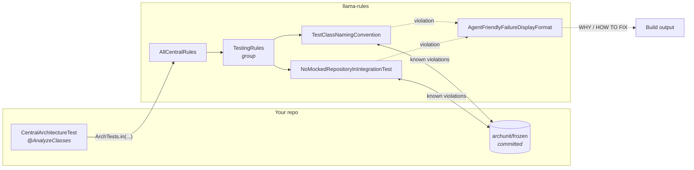
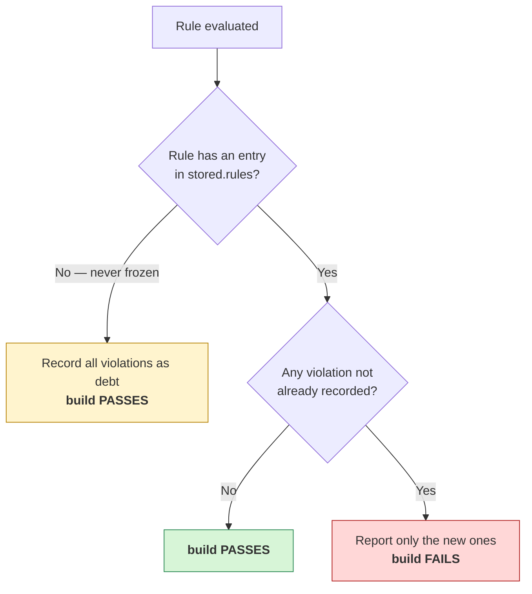

# LLamaRules

Centralized [ArchUnit](https://www.archunit.org/) rules you write once and enforce everywhere. One
test-scoped dependency, one thin test class, and your architecture rules stop being prose in a wiki.

## What you get

| | |
|---|---|
| **Write once, enforce everywhere** | Rules live in this library, not copy-pasted into every repo. Consumers add one dependency and one test class. |
| **Adoption never blocks** | Every rule is frozen. Existing violations are recorded as debt on first run; only *new* ones fail. You can adopt a rule on a codebase that breaks it 200 times, today. |
| **Failures teach** | A violation prints why the rule exists, how to fix it, and how *not* to fake a fix — written for whoever (or whatever) reads the build log. |
| **Runnable at any granularity** | The wiring produces a real JUnit tree, so you can run the whole suite, one group, or a single rule from the IDE gutter. |
| **Composable** | A rule is a class, a group wraps rules, a group can wrap groups. Nests to any depth. |
| **Guarded against silent decay** | The ways this could quietly stop enforcing anything — a rule registered but never evaluated, a group added but never wired — are covered by tests that fail loudly. |

## How it fits together



Each arrow from a group is an `@ArchTest ArchTests` field; each leaf is an `@ArchTest ArchRule`.
Because `ArchTests.in(X)` descends into `X`'s `@ArchTest` fields, the same shape nests indefinitely —
`AllCentralRules` is just a group whose members happen to be groups.

## Quick start

**1. Depend on it** (see [Install](#install) for the GitHub Packages repository and auth):

```xml
<dependency>
  <groupId>io.github.milczekt1</groupId>
  <artifactId>llama-rules</artifactId>
  <version>0.1.0-SNAPSHOT</version>
  <scope>test</scope>
</dependency>
```

**2. Add one test class** — `src/test/java/com/acme/CentralArchitectureTest.java`:

```java
@AnalyzeClasses(packages = "com.acme", importOptions = ImportOption.DoNotIncludeJars.class)
class CentralArchitectureTest {
    @ArchTest
    static final ArchTests all = ArchTests.in(AllCentralRules.class);
}
```

> Do **not** add `ImportOption.DoNotIncludeTests`. The testing rules inspect your test classes;
> excluding them makes those rules pass vacuously — green build, zero enforcement.

**3. Configure ArchUnit** — `src/test/resources/archunit.properties`:

```properties
freeze.store.default.path=src/test/resources/archunit/frozen
failureDisplayFormat=io.github.milczekt1.llamarules.format.AgentFriendlyFailureDisplayFormat
```

**4. Seed the freeze store once, and commit it:**

```bash
mvn test -Darchunit.freeze.store.default.allowStoreCreation=true
git add src/test/resources/archunit/frozen && git commit -m "chore: freeze existing violations"
```

Existing violations are now debt. Only new ones fail.

## What a failure looks like

```
Architecture Violation [test.class-naming-convention] [Priority: MEDIUM]

WHY:
  Most build tools select which top-level classes to run by class-name convention
  (Maven's Surefire and Failsafe plugins, for example, match *Test and *IT
  respectively). A top-level class holding JUnit test methods — @Test,
  @ParameterizedTest, @RepeatedTest, @TestFactory or @TestTemplate — whose name
  ends in neither Test nor IT is silently never executed: it looks like coverage
  in the source tree while proving nothing in CI.

HOW TO FIX:
  Rename the reported top-level class to end in Test (unit tests) or IT
  (integration tests) so your build tool's test-selection convention picks it up…

HOW NOT TO FIX (this rule):
  Do NOT delete the test methods or the class to make this rule pass, and do NOT
  widen your build tool's test-include configuration instead of renaming…

HOW NOT TO FIX (always):
  - Do NOT edit, hand-write, or delete files under archunit/frozen/ to make a NEW
    violation disappear…
  - Do NOT silence the rule with @SuppressWarnings, @ArchIgnore, comments, or by
    disabling the test.
  - …

Offending locations:
  Class <com.acme.LegacyChecks> does not have simple name ending with 'IT'…
```

The anti-fix policy is appended to **every** failure and cannot be dropped per rule — the point is
that the cheap escape routes are named before someone reaches for one.

`failureDisplayFormat` is global per run, but the formatter falls back to ArchUnit's standard output
for any rule it does not own, so your own ArchUnit tests render unchanged.

## Rules

| Rule id | Group | What it enforces |
|---|---|---|
| `test.no-mocked-repository-in-integration-test` | `TestingRules` | An `*IT` class must not declare a mocked (`@Mock`, `@MockitoBean`, `@MockBean`) field whose type ends in `Repository` or `Dao`. |
| `test.class-naming-convention` | `TestingRules` | A top-level class holding JUnit test methods (`@Test`, `@ParameterizedTest`, `@RepeatedTest`, `@TestFactory`, `@TestTemplate`) must end in `Test`, `Tests` or `IT`. Nested classes — including JUnit 5 `@Nested` groups — are exempt: they run through their enclosing class. |

This table is maintained by hand; nothing in the build checks it.

> **Rule ids are freeze-store keys.** Changing an id orphans every consumer's frozen entry, so treat
> it as a breaking change.

## How freezing decides

The single thing worth understanding before you trust the build:



Two consequences follow, and they are the questions people actually ask:

- **A rule added today, violated in three months, fails.** The first run records an index entry (with
  zero violations). Three months later that violation is new, so the build fails. It is *not*
  accepted as debt.
- **Commit the `stored.rules` change** produced by that first run. Uncommitted, CI sees no entry,
  takes the left branch above, and absorbs the first violation silently — a rule that looks armed and
  is not.

> **Changing a rule's predicate invalidates frozen entries for it.** ArchUnit matches known
> violations by their rendered *text*, so widening a rule from `Test`/`IT` to `Test`/`Tests`/`IT`
> rewrites every message it produces — the frozen entries stop matching and the same old violations
> resurface as new ones. That is a breaking change for consumers on the same footing as renaming an
> id: they must re-freeze. Batch predicate changes into a release and say so in the notes.

## Install

The artifact is published to GitHub Packages, which Maven does not know about by default:

```xml
<repositories>
  <repository>
    <id>github</id>
    <name>GitHub Packages</name>
    <url>https://maven.pkg.github.com/MilczekT1/LLamaRules</url>
    <snapshots><enabled>true</enabled></snapshots>
  </repository>
</repositories>
```

GitHub Packages requires authentication even for public reads. Add a matching server to
`~/.m2/settings.xml` — the `<id>` must equal the repository `<id>`:

```xml
<servers>
  <server>
    <id>github</id>
    <username>YOUR_GITHUB_USERNAME</username>
    <password>YOUR_GITHUB_TOKEN</password>  <!-- classic PAT with read:packages -->
  </server>
</servers>
```

Without both pieces the build fails with `Could not find artifact io.github.milczekt1:llama-rules`.
In CI use a secret, not a checked-in token (`${env.GITHUB_TOKEN}` interpolates in `settings.xml`).

`0.1.0-SNAPSHOT` is a snapshot; no release has been cut yet.

## Configuration reference

| Property | Required | Notes |
|---|---|---|
| `freeze.store.default.path` | yes | Resolved against the JVM's **working directory**, not the classpath. Maven sets it to the module directory; an IDE run configuration with a different working directory will not find the store. |
| `failureDisplayFormat` | recommended | Without it you get ArchUnit's default one-line output instead of WHY / HOW TO FIX. |
| `freeze.store` | optional | Set to `io.github.milczekt1.llamarules.freeze.EmptyOmittingViolationStore` to keep empty violation files out of your commits — see below. |
| `freeze.store.default.allowStoreCreation` | **never commit as `true`** | See the warning below. |

> **Do not put `freeze.store.default.allowStoreCreation=true` in `archunit.properties`.** ArchUnit
> defaults it to `false`, and that default is the only thing separating "the store is missing" from
> "silently freeze everything and pass". Pinned to `true`, a store that was never committed, got
> gitignored, or was lost to a shallow checkout gives you a green build with every violation
> re-frozen and no signal at all. Left at its default, the same situation fails loudly with
> `Creating new violation store is disabled (…)`. ArchUnit merges any `archunit.`-prefixed system
> property, which is why the one-off override in step 4 works without editing the committed file.

### Empty violation files

A rule that is already clean still gets frozen: ArchUnit records it in `stored.rules` *and* writes an
empty violation file. The index entry is what keeps the rule enforced (see the flowchart above); the
empty file is noise in a commit.

`freeze.store=io.github.milczekt1.llamarules.freeze.EmptyOmittingViolationStore` keeps the entry and
drops only the file. Three things to know:

- **Opt-in.** Leave the line out and you get ArchUnit's stock store, empty files included.
- **Global per run.** ArchUnit uses it for *every* `FreezingArchRule` in the run, including your own.
  The behaviour change is narrow and the index entry is always preserved, so your own frozen rules
  stay exactly as enforced.
- **Not retroactive.** Switching it on leaves already-committed empty files in place —
  `FreezingArchRule` only writes when it has something to change, and a rule that is clean and stays
  clean never triggers a write. Clear them once with `mvn test -Darchunit.freeze.refreeze=true` (or
  delete them by hand) and review the diff: `refreeze` re-records *every* rule, so anything currently
  failing gets absorbed as debt too.

## Extending

### The shape

One rule, one class. A rule class under `rules/<topic>/` owns everything about that rule; a group
under `groups/` is a thin wrapper composing rule classes; `AllCentralRules` is a group of groups.

Every node states its membership **twice** — as `@ArchTest` fields (what `ArchTests.in(...)` descends
into, i.e. what consumers run) and in a static `members()` (what tooling reads). `GroupMembershipTest`
walks the whole tree and fails on any node where the two disagree, or on any group with `@ArchTest
ArchTests` fields but no `members()`. It is recursive on purpose: a new group is guarded the moment it
becomes reachable, so there is no per-group test to remember to write.

### Adding a rule to an existing group

1. Create `rules/<topic>/<RuleName>.java` — public final class, private constructor, three members
   (see `TestClassNamingConvention`):
   - `static final RuleDoc DOC` — id is `<topic>.<kebab-case-rule>`, matching
     `^[a-z0-9]+(\.[a-z0-9-]+)+$`.
   - `static final ArchRule RULE` — the raw rule, package-private. Tests exercise *this*; the public
     field is frozen, so it seeds and passes, which would make rule-correctness tests meaningless.
   - `@ArchTest public static final ArchRule rule = FrozenRules.freeze(RULE, DOC);` — `freeze`
     registers the doc, renames the rule to the doc id (that name is the freeze-store key), and
     allows an empty `should`.
2. In the group, add the class to `MEMBERS` **and** give it an `@ArchTest ArchTests` field. Both,
   always. Add only the `members()` entry and the rule is documented and completeness-checked but
   **never evaluated by any consumer**.
3. Add fixtures under `src/test/java/.../fixtures/<topic>/` — at least one class the rule must flag
   and one it must leave alone. Surefire excludes `**/fixtures/**`, so fixtures named `*Test`/`*IT`
   are not executed. Then write `rules/<topic>/<RuleName>Test.java` against the raw `RULE`, asserting
   **both** directions: a test that only asserts what the rule ignores passes vacuously if the scan
   ever finds nothing.
4. Add a pairing test to the group's `<Group>FrozenFieldsTest` via `FrozenFieldStores.assertFreezes(…)`
   and bump `PAIRING_TESTS`. This catches `FrozenRules.freeze(A_RULE, B_DOC)`, which every other test
   in the suite would pass.
5. Extend the expected id set in `AllCentralRulesTest.ruleDiscoveryDescendsThroughNestedGroups`.
6. Add a row to the [Rules](#rules) table. Nothing enforces this — it is on you.

### Adding a group

`Java17Rules`, `JakartaMigrationRules` and `SpringRules` are intentionally not in the first cut. On
top of the rule steps:

1. Create `groups/<Topic>Rules.java` — copy `TestingRules`: private `MEMBERS`, one `@ArchTest
   ArchTests` field per member, `public static List<Class<?>> members()`.
2. Add it to `AllCentralRules.MEMBERS` **and** give it an `@ArchTest ArchTests` field there. Skipping
   the field is the dangerous half: the build stays green while no consumer ever evaluates the group.
3. Update `AllCentralRulesTest.groupsAreListedInDocumentationOrder`.
4. Create the group's `<Group>FrozenFieldsTest` (copy `TestingRulesFrozenFieldsTest`).

No membership guard test is needed — `GroupMembershipTest` covers it by construction.

## Contributing

Uses [Lombok](https://projectlombok.org/). Install your IDE's Lombok plugin, or the IDE reports errors
on generated members that `mvn verify` compiles cleanly.

Lombok is wired through `annotationProcessorPaths` in the root `pom.xml`, not just as a dependency —
JDK 23+ ignores annotation processors that are only on the classpath. Remove that block and
compilation fails on the generated members (`RuleDoc.builder()`, the formatter's `log`), so the
misconfiguration cannot pass silently.

Build: `./mvnw verify`. The reactor is `rules` (the library) and `rules-example` (a working consumer
with a committed freeze store, which doubles as an end-to-end test of the wiring).

## License

MIT
