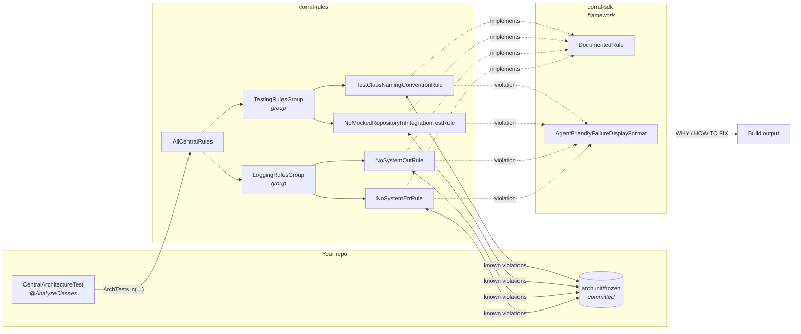
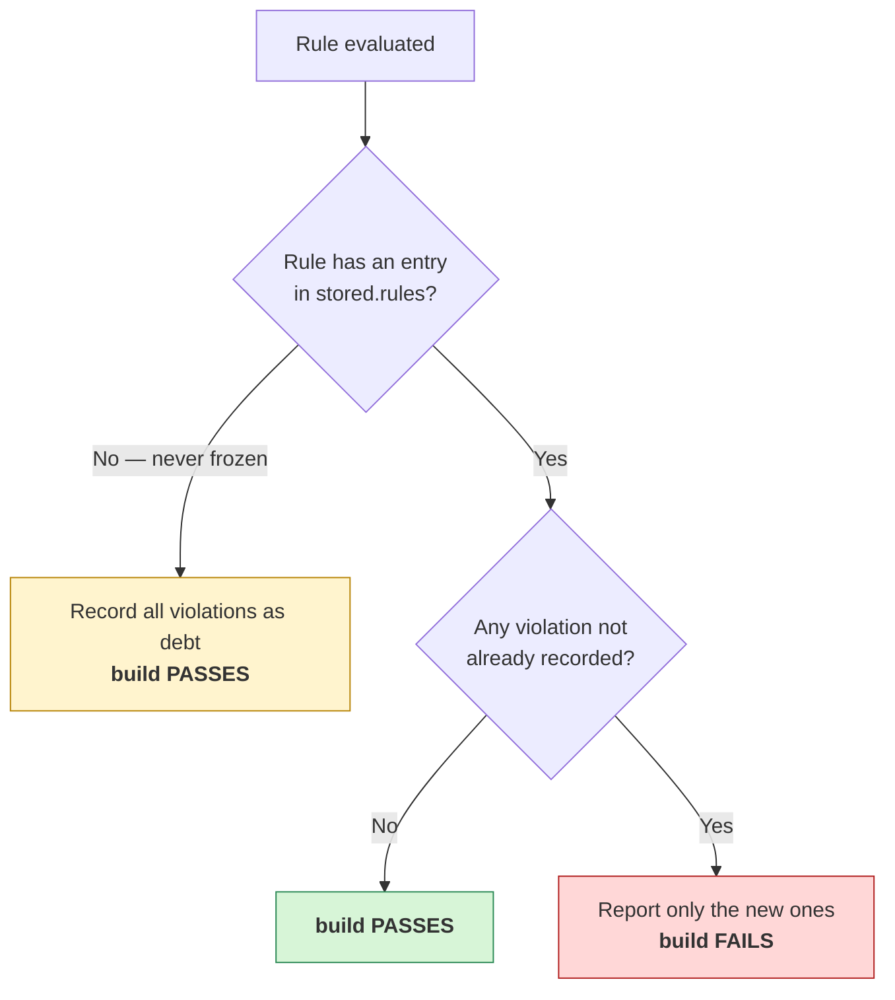

# Corral

[](https://sonarcloud.io/summary/new_code?id=MilczekT1_Corral)

Centralized [ArchUnit](https://www.archunit.org/) rules you write once and enforce everywhere. One
test-scoped dependency, one thin test class, and your architecture rules stop being prose in a wiki.

## What you get

| | |
|---|---|
| **Write once, enforce everywhere** | Rules live in this library, not copy-pasted into every repo. Consumers add one dependency and one test class. |
| **Adoption never blocks** | Every rule is frozen. Existing violations are recorded as debt on first run; only *new* ones fail. You can adopt a rule on a codebase that breaks it 200 times, today. |
| **Failures teach** | A violation prints why the rule exists, how to fix it, and how *not* to fake a fix — written for whoever (or whatever) reads the build log. |
| **Runnable at any granularity** | The wiring produces a real JUnit tree, so you can run the whole suite, one group, or a single rule from the IDE gutter. |
| **Composable** | A rule is a class, a group wraps rules, a group can wrap groups. Nests to any depth. |
| **One rule off, catalog on** | A rule that is wrong for your codebase — not "not yet", but never — goes in `corral-exclusions.txt` with a reason. You keep the single wiring field, and keep receiving new rules as the catalog grows. |
| **Guarded against silent decay** | The ways this could quietly stop enforcing anything — a rule registered but never evaluated, a group added but never wired — are covered by tests that fail loudly. |

## How it fits together



Each arrow from a group is an `@ArchTest ArchTests` field; each leaf is an `@ArchTest ArchRule`.
Because `ArchTests.in(X)` descends into `X`'s `@ArchTest` fields, the same shape nests indefinitely —
`AllCentralRules` is just a group whose members happen to be groups.

The two jars split by role: `corral-sdk` is the framework for authoring rules, `corral-rules`
is the catalog of rules built on it. Depending on the catalog pulls the framework in transitively;
depend on the SDK alone to write your own rules without adopting these.

## Quick start

**1. Depend on it** (see [Install](#install) for the GitHub Packages repository and auth):

No release is published yet. Cut `0.1.0` via the [Release workflow](#release-process) first, then
depend on it:

```xml
<dependency>
  <groupId>io.github.milczekt1</groupId>
  <artifactId>corral-rules</artifactId>
  <version>0.1.0</version>
  <scope>test</scope>
</dependency>
```

**2. Add one test class** — `src/test/java/com/acme/CentralArchitectureTest.java`:

```java
@AnalyzeClasses(packages = "com.acme", importOptions = ImportOption.DoNotIncludeJars.class)
class CentralArchitectureTest {
    @ArchTest
    static final ArchTests all = ArchTests.in(AllCentralRules.class);
}
```

> Do **not** add `ImportOption.DoNotIncludeTests`. The testing rules inspect your test classes;
> excluding them makes those rules pass vacuously — green build, zero enforcement.

**3. Configure ArchUnit** — `src/test/resources/archunit.properties`:

```properties
freeze.store.default.path=src/test/resources/archunit/frozen
failureDisplayFormat=io.github.milczekt1.corral.format.AgentFriendlyFailureDisplayFormat
```

> `archunit_ignore_patterns.txt` silently deletes violations before Corral ever sees them, so Corral
> fails the build when that file is on the classpath — add `corral.ignorePatterns.fail=false` to the
> block above if the file is yours and deliberate. Every copy found is named, because ArchUnit reads
> only the first and it may belong to a dependency rather than to you.

**4. Seed the freeze store once, and commit it:**

```bash
mvn test -Darchunit.freeze.store.default.allowStoreCreation=true
git add src/test/resources/archunit/frozen && git commit -m "chore: freeze existing violations"
```

Existing violations are now debt. Only new ones fail.

## What a failure looks like

```text
Architecture Violation [test.class-names-must-end-with-test-or-it] [Priority: MEDIUM]

WHY:
  Most build tools select which top-level classes to run by class-name convention
  (Maven's Surefire and Failsafe plugins, for example, match *Test and *IT
  respectively). A top-level class holding JUnit test methods — @Test,
  @ParameterizedTest, @RepeatedTest, @TestFactory or @TestTemplate — whose name
  ends in neither Test nor IT is silently never executed: it looks like coverage
  in the source tree while proving nothing in CI.

HOW TO FIX:
  Rename the reported top-level class to end in Test (unit tests) or IT
  (integration tests) so your build tool's test-selection convention picks it up…

HOW NOT TO FIX (this rule):
  Do NOT delete the test methods or the class to make this rule pass, and do NOT
  widen your build tool's test-include configuration instead of renaming…

HOW NOT TO FIX (always):
  - Do NOT edit, hand-write, or delete files under archunit/frozen/ to make a NEW
    violation disappear…
  - Do NOT re-run with archunit.freeze.refreeze=true, and do NOT commit
    freeze.store.default.allowStoreCreation=true…
  - Do NOT add to or create archunit_ignore_patterns.txt. ArchUnit discards anything
    matching that file before this rule, the freeze store, or this message ever sees
    it, leaving no record anywhere…
  - Do NOT set corral.ignorePatterns.fail=false to make that check go away. It exists
    to report the file above, so disarming it restores the silence…
  - Do NOT silence the rule with @SuppressWarnings, @ArchIgnore, comments, or by
    disabling the test.
  - corral-exclusions.txt removes a rule from your build permanently, because it does
    not apply to this codebase. It is not a way to pass a failing build…
  - …

Offending locations:
  Class <com.acme.InvalidlyNamedTestClass> does not have simple name ending with 'IT'…
```

The anti-fix policy is appended to **every** failure and cannot be dropped per rule — the point is
that the cheap escape routes are named before someone reaches for one.

`failureDisplayFormat` is global per run, but the formatter falls back to ArchUnit's standard output
for any rule it does not own, so your own ArchUnit tests render unchanged.

## Rules

| Rule id | Group | What it enforces |
|---|---|---|
| `test.no-mocked-repository-in-integration-test` | `TestingRulesGroup` | An `*IT` class must not declare a mocked (`@Mock`, `@MockitoBean`, `@MockBean`) field whose type ends in `Repository` or `Dao`. |
| `test.class-names-must-end-with-test-or-it` | `TestingRulesGroup` | A top-level class holding JUnit test methods (`@Test`, `@ParameterizedTest`, `@RepeatedTest`, `@TestFactory`, `@TestTemplate`) must end in `Test`, `Tests` or `IT`. Nested classes — including JUnit 5 `@Nested` groups — are exempt: they run through their enclosing class. |
| `logging.no-system-out` | `LoggingRulesGroup` | No class may access `System.out`. Matched as a field access, so every overload of `println`, plus `print`, `printf` and `write`, is covered — static initializers included. |
| `corral.exclusions-resolve` | `AllCentralRules` | Every line of `corral-exclusions.txt` names an id this build wires. Not an architecture rule — it guards the exclusion mechanism itself, and only runs when the catalog root is wired. |
| `logging.no-system-err` | `LoggingRulesGroup` | No class may access `System.err`. Same field-access match. Kept separate from `logging.no-system-out` so stdout debt and stderr debt freeze under their own keys. `throwable.printStackTrace()` is *not* matched: the field access happens inside `java.lang.Throwable`. |

This table is maintained by hand; nothing in the build checks it.

> **Rule ids are freeze-store keys.** Changing an id orphans every consumer's frozen entry, so treat
> it as a breaking change.

## How freezing decides

The single thing worth understanding before you trust the build:



Two consequences follow, and they are the questions people actually ask:

- **A rule added today, violated in three months, fails.** The first run records an index entry (with
  zero violations). Three months later that violation is new, so the build fails. It is *not*
  accepted as debt.
- **Commit the `stored.rules` change** produced by that first run. Uncommitted, CI sees no entry,
  takes the left branch above, and absorbs the first violation silently — a rule that looks armed and
  is not.

> **Changing a rule's predicate invalidates frozen entries for it.** ArchUnit matches known
> violations by their rendered *text*, so widening a rule from `Test`/`IT` to `Test`/`Tests`/`IT`
> rewrites every message it produces — the frozen entries stop matching and the same old violations
> resurface as new ones. That is a breaking change for consumers on the same footing as renaming an
> id: they must re-freeze. Batch predicate changes into a release and say so in the notes.

## Excluding a rule

Some rules are simply wrong for some codebases. `spring.no-transactional-on-final` is wrong under
AspectJ load-time weaving, where the annotation genuinely does apply. `logging.no-log4j-api-directly`
is wrong for a project whose facade *is* the Log4j 2 API. No per-violation carve-out helps: the whole
codebase disagrees with the rule's premise.

Without a way to say that, the only option is to stop using `AllCentralRules` and enumerate the rules
you do want — which costs you the thing the single field was for. **You stop receiving new rules**,
and every catalog release becomes a manual diff against your wiring.

Instead, name the rule in `src/test/resources/corral-exclusions.txt`, beside `archunit.properties`:

```text
# <rule-id> :: <reason>
spring.no-transactional-on-final :: AspectJ load-time weaving; the annotation applies. ADR-021.
logging.no-log4j-api-directly    :: The Log4j 2 API is our facade by decision.
```

The named rules evaluate nothing and pass. Every other rule is untouched, and you keep
`ArchTests.in(AllCentralRules.class)` — you have removed one rule, not opted out of the mechanism
that delivers them. With no file present nothing changes for anyone.

This is deliberately blunt: it can only remove a whole rule, never one violation. A change that
disables a rule entirely is loud in review, unlike a suppression that hides one violation and looks
small.

**The guardrails:**

| | |
|---|---|
| The id must be a **catalog rule** `AllCentralRules` publishes | A typo excludes nothing while reading as though it did, and a rule renamed upstream would silently come back on. Both fail the build, listing the excludable ids. Checked by `corral.exclusions-resolve` — see below. |
| A **reason is mandatory** | A line without `::` and non-empty text after it is a parse error. Corral cannot judge whether a reason is a good one; it can make its absence fatal. |
| A file that cannot be read **excludes nothing and fails everything** | A file that is not understood must not be trusted to remove a rule. Every broken line is reported at once, with its line number. |
| Resolved with `getResources` (**plural**) | More than one copy on the classpath fails, naming each. Otherwise first-match-wins decides which rules you enforce, and the winner could belong to a test-scoped dependency rather than to you. |
| Every exclusion in effect is **printed on any rule failure** | Under `EXCLUDED IN THIS BUILD`, so whoever reads a failing build sees what is *not* being enforced — including on rules the file never named, since an excluded rule never fails and so can never print it itself. |

**This file names catalog rules.** A rule *you* wrote is not removed here — stop wiring it, by
deleting its `@ArchTest` field from your group. That is why `corral.exclusions-resolve` accepts only
ids reachable from `AllCentralRules`: it walks that tree, which is the one set of ids that is the
same in every run. Validating against "whatever has registered so far" would make the verdict depend
on which tests happened to run, and a check that answers differently run to run is worse than one
with a stated limit.

The check runs wherever `AllCentralRules` is wired, so a run of one leaf from the IDE gutter applies
your exclusions without verifying them. `corral.exclusions-resolve` itself cannot be excluded.

> **An exclusion is not a pause button.** An excluded rule records nothing while it is off, so any
> violation the codebase acquires meanwhile is *new* the day you delete the line — and the build
> fails on code nobody touched that day. Corral keeps the frozen entries intact (the exclusion wraps
> the frozen rule rather than replacing it, so the store is never rewritten as clean), but it cannot
> record what it never evaluated. Re-enable a rule the way you adopt one: expect to re-freeze, and
> read the diff.

Adding a rule to this file in the same change that made it fail is silencing, not excluding — and
reads that way in the diff. The [anti-fix policy](#what-a-failure-looks-like) says so on every
failure.

## Install

The artifact is published to GitHub Packages, which Maven does not know about by default:

```xml
<repositories>
  <repository>
    <id>github</id>
    <name>GitHub Packages</name>
    <url>https://maven.pkg.github.com/MilczekT1/Corral</url>
    <snapshots><enabled>true</enabled></snapshots>
  </repository>
</repositories>
```

GitHub Packages requires authentication even for public reads. Add a matching server to
`~/.m2/settings.xml` — the `<id>` must equal the repository `<id>`:

```xml
<servers>
  <server>
    <id>github</id>
    <username>YOUR_GITHUB_USERNAME</username>
    <password>YOUR_GITHUB_TOKEN</password>  <!-- classic PAT with read:packages -->
  </server>
</servers>
```

Without both pieces the build fails with `Could not find artifact io.github.milczekt1:corral-rules`.
In CI use a secret, not a checked-in token (`${env.GITHUB_TOKEN}` interpolates in `settings.xml`).

[Release](#release-process) publishes released `x.y.z` versions. Snapshots are published manually:
dispatch [Publish artifact](#release-process) on a ref whose project version ends in `-SNAPSHOT`
(`main`, typically). GitHub Packages rejects re-deploying an existing release version but accepts
re-deploying a snapshot, so `0.1.0-SNAPSHOT` can be refreshed as often as needed — which is what
makes it useful for trying a change before a release is cut.

No release has been cut yet, so `0.1.0` does not resolve until you cut one; publish a snapshot if
you want something to depend on in the meantime.

## Configuration reference

| Property | Required | Notes |
|---|---|---|
| `freeze.store.default.path` | yes | Resolved against the JVM's **working directory**, not the classpath. Maven sets it to the module directory; an IDE run configuration with a different working directory will not find the store. |
| `failureDisplayFormat` | recommended | Without it you get ArchUnit's default one-line output instead of WHY / HOW TO FIX. |
| `freeze.store` | optional | Set to `io.github.milczekt1.corral.store.EmptyOmittingViolationStore` to keep empty violation files out of your commits — see below. |
| `freeze.store.default.allowStoreCreation` | **never commit as `true`** | See the warning below. |
| `corral-exclusions.txt` | optional | Not a property — a file beside `archunit.properties`. Removes named rules from your build permanently; see [Excluding a rule](#excluding-a-rule). |
| `corral.ignorePatterns.fail` | optional, defaults to `true` | Every Corral rule fails, naming each copy found, when `archunit_ignore_patterns.txt` is on the classpath. Set it to `false` if that file is yours and deliberate. |

> **Do not put `freeze.store.default.allowStoreCreation=true` in `archunit.properties`.** ArchUnit
> defaults it to `false`, and that default is the only thing separating "the store is missing" from
> "silently freeze everything and pass". Pinned to `true`, a store that was never committed, got
> gitignored, or was lost to a shallow checkout gives you a green build with every violation
> re-frozen and no signal at all. Left at its default, the same situation fails loudly with
> `Creating new violation store is disabled (…)`. ArchUnit merges any `archunit.`-prefixed system
> property, which is why the one-off override in step 4 works without editing the committed file.

### The freeze store

`freeze.store=io.github.milczekt1.corral.store.EmptyOmittingViolationStore` changes two things
about how the store is written.

**Violation files are named after the rule id.** Stock ArchUnit names them with a random UUID, so
reading a store means resolving names through `stored.rules` first:

```text
archunit/frozen/
├── stored.rules
├── test.class-names-must-end-with-test-or-it  # instead of 56d55a4e-91ac-4e12-8682-030d6f3f746f
└── logging.no-stdout-in-services
```

`git log -p archunit/frozen/test.class-names-must-end-with-test-or-it` is then that rule's debt history. Only ids
get this treatment: the store is global, so it also serves rules frozen without a `RuleDoc`, whose
descriptions are whole sentences — those keep a UUID. Names are assigned once, when a rule is first
frozen, so existing stores keep their UUIDs and keep working.

**A clean rule leaves no file.** A rule that is already clean still gets frozen: ArchUnit records it
in `stored.rules` *and* writes an empty violation file. The index entry is what keeps the rule
enforced (see the flowchart above); the empty file is noise in a commit. This store keeps the entry
and drops the file. Three things to know:

- **Opt-in.** Leave the line out and you get ArchUnit's stock store, empty files included.
- **Global per run.** ArchUnit uses it for *every* `FreezingArchRule` in the run, including your own.
  The behaviour change is narrow and the index entry is always preserved, so your own frozen rules
  stay exactly as enforced.
- **Not retroactive.** Switching it on leaves already-committed empty files in place —
  `FreezingArchRule` only writes when it has something to change, and a rule that is clean and stays
  clean never triggers a write. Clear them once with `mvn test -Darchunit.freeze.refreeze=true` (or
  delete them by hand) and review the diff: `refreeze` re-records *every* rule, so anything currently
  failing gets absorbed as debt too.

## Extending

Adding a rule, adding a group, and the package layout that keeps the dependency arrows pointing one
way are covered in **[CONTRIBUTING.md](CONTRIBUTING.md)**:

- [The shape](CONTRIBUTING.md#the-shape) — one rule one class, and which package owns what
- [Adding a rule to an existing group](CONTRIBUTING.md#adding-a-rule-to-an-existing-group)
- [A rule in more than one group](CONTRIBUTING.md#a-rule-in-more-than-one-group)
- [Adding a group](CONTRIBUTING.md#adding-a-group)
- [What breaks consumers](CONTRIBUTING.md#what-breaks-consumers) — rule ids and predicate text are
  both freeze-store keys, so changing either is a breaking change

## CI/CD

Every push and pull request to `main` runs **Build Pipeline**
(`.github/workflows/build-java.yml`): a `build` job (`./mvnw clean install`) and a
`sonar_scan` job (`./mvnw clean verify` plus a SonarCloud scan). Coverage comes from jacoco,
which fails the build at `verify` below the thresholds in the root `pom.xml`
(`jacoco.lineCoverage.minimum`, `jacoco.branches.minimum`, `jacoco.classes.maxMissed`).
`corral-example` overrides them to zero and sets `sonar.skip=true` — it is a wiring demo, not a
tested component. Its classes exist to be flagged by rules and its violations are deliberate and
committed, so analysing it would report the demo itself as findings. It is still compiled and its
tests still run: that module is the end-to-end test of the wiring.

### Release process

Releases run in CI via the **Release** GitHub Actions workflow (manual `workflow_dispatch`
trigger). Only allowlisted users may trigger it.

1. Go to **Actions → Release → Run workflow**.
2. Enter:
    - **releaseVersion** — the version to release, e.g. `0.1.0` (no `-SNAPSHOT`).
    - **nextVersion** — the next development version, e.g. `0.1.1` (no `-SNAPSHOT`; the
      workflow appends it).
3. Run it. The workflow checks you are on the allowlist, creates branch `release/v<version>`,
   sets the release version and commits + tags `v<version>` on it (crediting you as
   co-author), publishes `corral-sdk`, `corral-rules` and `corral-parent` to
   GitHub Packages — consumers need the parent pom to resolve the managed dependency
   versions — bumps to
   `<nextVersion>-SNAPSHOT`, pushes the branch + tag, creates the GitHub Release, then opens a
   PR (`release/v<version>` → `main`) and enables **auto-merge**. The PR merges automatically
   once the required build check passes.

Before publishing, the workflow runs `./mvnw clean verify` on the version-bumped tree. That tree
has never been built by any CI run — `versions:set` has just rewritten the poms — and publishing to
GitHub Packages cannot be undone, so the tests and the coverage gate run against exactly what is
about to be released. The `deploy` step itself then uses `-DskipTests=true` rather than testing
twice.

`corral-example` is never published — its `maven-deploy-plugin` is skipped, and the
workflow's already-published check skips it for the same reason.

The trigger allowlist is hardcoded in `.github/workflows/release.yml` as
`RELEASE_ALLOWED_ACTORS` (space-separated GitHub usernames); edit it via a normal PR.

**One-time setup (maintainer):**

- Create the SonarCloud project `MilczekT1_Corral` in organization `milczekt1` and store
  its token as repo secret `SONAR_TOKEN`. This is a first-ever analysis: the project must
  exist before the first scan (import it in the SonarCloud UI, or let the scan auto-provision
  it if the token's user holds *Create Projects* in the organization). The first run has no
  previous analysis to diff against, so its new-code quality gate conditions are vacuous.
- Install a **GitHub App** on the repo with **Contents: write** and **Pull requests: write**,
  and store its credentials as repo secrets `RELEASE_APP_ID` and `RELEASE_APP_PRIVATE_KEY`.
  The release PR is created under this App so it triggers CI (a PR created by the default
  token would not, and auto-merge would hang).
- Enable **Settings → General → Allow auto-merge** and **Allow rebase merging** — the release
  PR is merged with `gh pr merge --auto --rebase`.
- Keep the **build check required** on `main` branch protection — this is the gate
  auto-merge waits on.

`publish-java.yml` ("Publish artifact (manual)") publishes without bumping or tagging. Two uses:
re-publishing an already-released `x.y.z` (only if it is not already present — GitHub Packages
rejects re-deploying an existing release version), and publishing a `-SNAPSHOT` so consumers can
try a change before a release is cut. Snapshots may be re-deployed repeatedly.

The checked-out ref — not the `version` input — determines what gets published. Select the tag
`v<version>` to re-publish a release, or a branch such as `main` to publish its snapshot; the
input is only asserted against what is checked out, never used to check anything out.

## Contributing

See **[CONTRIBUTING.md](CONTRIBUTING.md)** for build instructions, the Lombok setup, commit
conventions and what a pull request is expected to cover.

Quick version: `./mvnw verify`. The reactor is `corral-sdk` (the framework), `corral-rules` (the
rule catalog) and `corral-example` (a working consumer with a committed freeze store, which doubles
as an end-to-end test of the wiring). Java 17 is the baseline. Install your IDE's
[Lombok](https://projectlombok.org/) plugin or the IDE reports errors on generated members that
`mvn verify` compiles cleanly.

Participation is governed by our [Code of Conduct](CODE_OF_CONDUCT.md).

Security vulnerabilities go through a [private advisory](SECURITY.md), not a public issue.

## License

MIT
