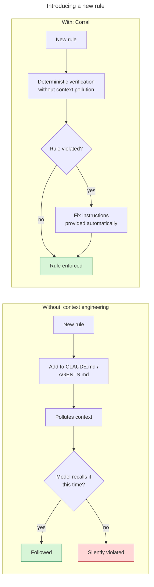

# Corral

**Architecture rules that survive contact with a coding agent.**

Your rules live in a wiki nobody reads, or in an [ArchUnit](https://www.archunit.org/) test class
copy-pasted into thirty repos and drifted in all thirty. Corral makes them a dependency.

[](https://github.com/MilczekT1/Corral/actions/workflows/build-java.yml) [](https://sonarcloud.io/summary/new_code?id=MilczekT1_Corral) [](LICENSE) [](pom.xml)

[**Rules**](docs/rules.md) · [**Quick start**](#quick-start) · [**Configuration**](docs/configuration.md) · [**Write your own**](docs/creating-a-rule.md) · [**Example consumer**](corral-example)



Corral verifies concrete statements, not vague descriptions. *No field injection* is something a
build can decide; *prefer boring solutions* is not, and stays in `CLAUDE.md`.

When the build goes red, an agent takes the cheapest path back to green: widen the scan, silence the
test, edit the frozen store. Every Corral failure names those paths before anyone reaches for one.

```text
Architecture Violation [corral.logging.no-system-out] [Priority: MEDIUM]

WHY:
  A write to System.out bypasses the logging configuration entirely: no level, no logger name, no
  structured context, no appender. It cannot be filtered, routed, shipped to an aggregator or
  silenced […]

HOW TO FIX:
  Log the message through the project's logger, at the level it deserves — log.debug for a trace
  someone enables while investigating, log.info for an event worth keeping […]

HOW NOT TO FIX (this rule):
  Do NOT route the same write through a wrapper to dodge the field match — a PrintStream local, a
  Console helper, a stream fetched reflectively — the output stays just as unmanaged and is now
  harder to find […]

HOW NOT TO FIX (always):
  - Do NOT edit, hand-write, or delete files under archunit/frozen/ to make a NEW violation
    disappear. The store records pre-existing debt only; new violations must be fixed in code.
  - Do NOT re-run with archunit.freeze.refreeze=true, and do NOT commit
    freeze.store.default.allowStoreCreation=true. Either one converts every current violation in
    every rule into accepted debt at once.
  - Do NOT add to or create archunit_ignore_patterns.txt. ArchUnit discards anything matching that
    file before this rule, the freeze store, or this message ever sees it, leaving no record
    anywhere. Nothing in this catalog is exempted that way.
  - Do NOT narrow @AnalyzeClasses(packages=...) or add ImportOptions to hide code from the scan.
  - …and five more…
  - The ONLY acceptable resolution is changing the production/test code so the rule genuinely
    passes — then follow this rule's HOW TO FIX.

Offending locations:
  Method <com.example.consumer.service.NoisyService.announce(java.lang.String)> gets field
  <java.lang.System.out> in (NoisyService.java:7)
```

Ten clauses, fixed in
[`AntiFixPolicy`](corral-sdk/src/main/java/io/github/milczekt1/corral/format/AntiFixPolicy.java),
appended to **every** failure, droppable by no rule. Two of them are enforced in code, not just
stated: an `archunit_ignore_patterns.txt` anywhere on the classpath fails every rule and names every
copy it found, and an exclusion needs a written reason that is then reprinted on every *other* rule's
failure for as long as it stands. The rest are guidance — legible in the diff, not blocked.

- **Adoption never blocks.** Every rule ships frozen: the first run records today's violations as
  debt and passes, only *new* ones fail. Adopt a rule on a codebase that breaks it 200 times, today.
- **Failures are written for whoever fixes them — increasingly a coding agent.** Every violation
  prints why the rule exists, how to fix it, and ten ways not to.
- **One test-scoped dependency, and you pick the groups you want.** Rules live in one versioned
  artifact, not copy-pasted into every repo. Ids carry a `corral.` prefix and are
  [never renamed](docs/rules.md#rule-ids), because an id is a freeze-store key in your repo.

## Quick start

**1. Depend on it** — see [Install](#install) for the repository and auth.

```xml
<dependency>
  <groupId>io.github.milczekt1</groupId>
  <artifactId>corral-rules</artifactId>
  <version>0.1.0-SNAPSHOT</version>
  <scope>test</scope>
</dependency>
```

**2. Wire the groups you want** — `src/test/java/com/acme/arch/ProjectArchitectureTest.java`.

```java
import com.tngtech.archunit.core.importer.ImportOption;
import com.tngtech.archunit.junit.AnalyzeClasses;
import com.tngtech.archunit.junit.ArchTest;
import com.tngtech.archunit.junit.ArchTests;
import io.github.milczekt1.corral.groups.LoggingRulesGroup;
import io.github.milczekt1.corral.groups.TestingRulesGroup;

@AnalyzeClasses(packages = "com.acme", importOptions = ImportOption.DoNotIncludeJars.class)
class ProjectArchitectureTest {

    @ArchTest static final ArchTests testing = ArchTests.in(TestingRulesGroup.class);
    @ArchTest static final ArchTests logging = ArchTests.in(LoggingRulesGroup.class);
}
```

> Do **not** add `ImportOption.DoNotIncludeTests`. The testing rules inspect your test classes;
> excluding them makes those rules pass vacuously — green build, zero enforcement.

The result is one JUnit tree: run the class, one group, or a single rule from the IDE gutter. A group
you do not wire is not enforced. Splitting across several test classes is fine — wire each rule from
exactly one of them, since a rule id is a freeze-store key. [`corral-example`](corral-example) is laid
out that way.

**3. Configure ArchUnit** — `src/test/resources/archunit.properties`. Without the second line, none
of the output above is printed.

```properties
freeze.store.default.path=src/test/resources/archunit/frozen
failureDisplayFormat=io.github.milczekt1.corral.format.AgentFriendlyFailureDisplayFormat
```

**4. Seed the freeze store once, then commit it.**

```bash
mvn test -Darchunit.freeze.store.default.allowStoreCreation=true
git add src/test/resources/archunit/frozen && git commit -m "chore: freeze existing violations"
```

Existing violations are now debt; only new ones fail. Two ways to end up green and enforcing nothing:
**not committing the store** (CI sees no entry, re-seeds, and absorbs the first real violation
silently), and **pinning `allowStoreCreation` in `archunit.properties`** instead of passing it once (a
lost store then silently re-freezes everything). Both are covered in
[Configuration](docs/configuration.md).

## What's in the catalog

Four rules today, in `TestingRulesGroup` and `LoggingRulesGroup` — ids and what each enforces are in
the **[rules catalog](docs/rules.md)**. Two jars: `corral-sdk` is the framework for authoring rules,
`corral-rules` the catalog built on it. Depend on the SDK alone to publish a catalog of your own.

## Docs

| I want to… | Guide |
|---|---|
| See every rule and what it enforces | [Rules catalog](docs/rules.md) |
| Tune freezing, the store and the formatter | [Configuration](docs/configuration.md) |
| Turn off one rule and keep the group | [Excluding a rule](docs/excluding-a-rule.md) |
| Write my own rule, or withdraw an id | [Creating](docs/creating-a-rule.md) · [Retiring](docs/retiring-a-rule.md) |
| Understand freezing: what passes, what fails | [Freezing](docs/freezing.md) |
| See how the pieces wire together | [Architecture](docs/architecture.md) |
| See a real consumer, end to end | [`corral-example`](corral-example) |

## Install

**Pre-release: no `x.y.z` is published yet**, so `0.1.0` does not resolve — publish a snapshot from
`main` if you want something to depend on today ([release process](docs/release-process.md)).

Artifacts go to GitHub Packages. Add `https://maven.pkg.github.com/MilczekT1/Corral` as a
`<repository>` with snapshots enabled, and a matching `<server>` in `~/.m2/settings.xml` under the
same `<id>` — GitHub authenticates even public reads, so it needs a classic PAT with `read:packages`
(in CI, `${env.GITHUB_TOKEN}`). Without both, Maven reports
`Could not find artifact io.github.milczekt1:corral-rules`.

## Contributing

`./mvnw verify`. Java 17 baseline, Lombok on the classpath. Design, the rule-id grammar and what
breaks consumers: **[CONTRIBUTING.md](CONTRIBUTING.md)**. Participation is governed by our
[Code of Conduct](CODE_OF_CONDUCT.md); vulnerabilities go through a
[private advisory](SECURITY.md). Licensed [MIT](LICENSE).
