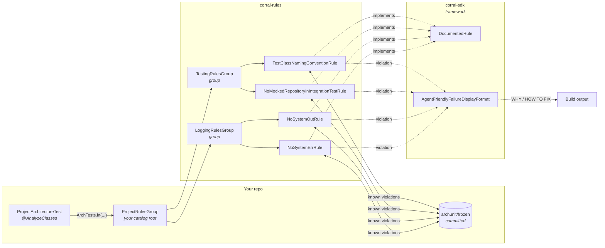

# How it fits together

Each arrow from a group is an `@ArchTest ArchTests` field; each leaf is an `@ArchTest ArchRule`.
Because `ArchTests.in(X)` descends into `X`'s `@ArchTest` fields, the same shape nests indefinitely —
`ProjectRulesGroup` is just a group whose members happen to be groups, and it lives in your repo.

The two jars split by role: `corral-sdk` is the framework for authoring rules, `corral-rules`
is the catalog of rules built on it. Depending on the catalog pulls the framework in transitively;
depend on the SDK alone to write your own rules without adopting these.

See also **[CONTRIBUTING.md § The shape](../CONTRIBUTING.md#the-shape)** for the authoring-side view:
one rule one class, how membership is declared, and why the module boundary enforces the direction.

> The class names above are illustrative. The [rules catalog](rules.md) is the current list.
