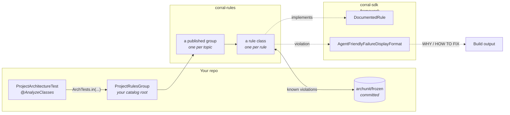

# How it fits together

```mermaid
flowchart LR
    subgraph consumer["Your repo"]
        CT["ProjectArchitectureTest<br/><i>@AnalyzeClasses</i>"]
        PRG["ProjectRulesGroup<br/><i>your catalog root</i>"]
        STORE[("archunit/frozen<br/><i>committed</i>")]
    end

    subgraph rules["corral-rules"]
        G["a published group<br/><i>one per topic</i>"]
        R["a rule class<br/><i>one per rule</i>"]
    end

    subgraph sdk["corral-sdk<br/><i>framework</i>"]
        DR["DocumentedRule"]
        FMT["AgentFriendlyFailureDisplayFormat"]
    end

    CT -->|"ArchTests.in(...)"| PRG
    PRG --> G
    G --> R
    R -.->|"implements"| DR
    R -.->|"violation"| FMT
    FMT -.->|"WHY / HOW TO FIX"| OUT["Build output"]
    R <-->|"known violations"| STORE
```

Each arrow from a group is an `@ArchTest ArchTests` field; each leaf is an `@ArchTest ArchRule`.
Because `ArchTests.in(X)` descends into `X`'s `@ArchTest` fields, the same shape nests indefinitely —
`ProjectRulesGroup` is just a group whose members happen to be groups, and it lives in your repo.
You wire one field per group you want; a group you leave out never runs.

The jars split by role. `corral-sdk` is the framework for authoring rules; `corral-rules` is the
catalog of rules built on it. Depending on a catalog jar pulls the framework in transitively; depend
on the SDK alone to write your own rules without adopting these.

Rules that only make sense on one major of a framework — a ban on an API the next major removes,
say — are *version-bound* and ship apart from `corral-rules`, in one
`corral-rules-<framework><major>` artifact per framework major. Each has the same shape as the
diagram above, its own groups and nothing beyond `corral-sdk` at compile scope. The version is in
the artifact id, so on the framework's next major the POM you edit names the dependency to drop.
Which of these artifacts exist is in the [rules catalog](rules.md); how one is built is in
[CONTRIBUTING.md § Version-bound rules](../CONTRIBUTING.md#version-bound-rules).

See also **[CONTRIBUTING.md § The shape](../CONTRIBUTING.md#the-shape)** for the authoring-side view:
one rule one class, how membership is declared, and why the module boundary enforces the direction.

> This page is the shape, not the inventory. Which groups exist and which rules each one ships are in
> the [rules catalog](rules.md), one row per rule — checked against the published groups by
> `RulesCatalogDocTest`.
