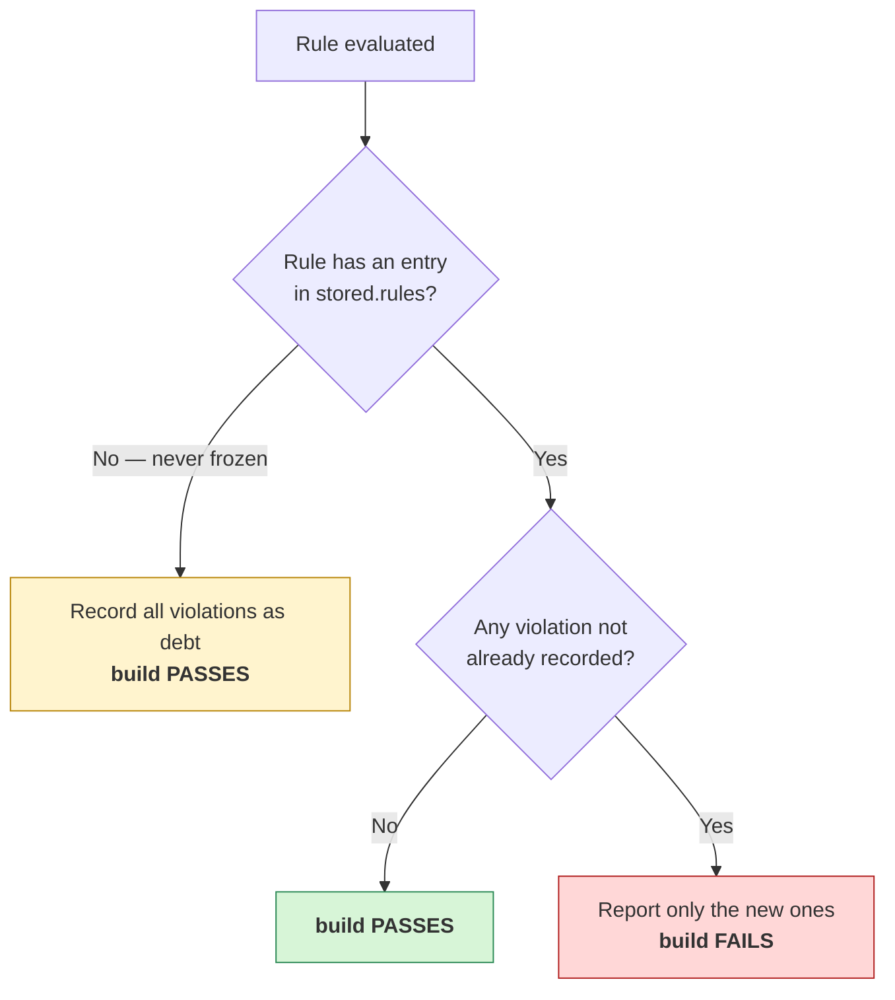

# How freezing decides

The single thing worth understanding before you trust the build:

Two consequences follow, and they are the questions people actually ask:

- **A rule added today, violated in three months, fails.** The first run records an index entry (with
  zero violations). Three months later that violation is new, so the build fails. It is *not*
  accepted as debt.
- **Commit the `stored.rules` change** produced by that first run. Uncommitted, CI sees no entry,
  takes the left branch above, and absorbs the first violation silently — a rule that looks armed and
  is not.

> **Changing a rule's predicate invalidates frozen entries for it.** ArchUnit matches known
> violations by their rendered *text*, so widening a rule from `Test`/`IT` to `Test`/`Tests`/`IT`
> rewrites every message it produces — the frozen entries stop matching and the same old violations
> resurface as new ones. That is a breaking change for consumers on the same footing as renaming an
> id: they must re-freeze. Batch predicate changes into a release and say so in the notes.

See also **[Configuration](configuration.md)** for the properties that control the store, and
**[CONTRIBUTING.md § What breaks consumers](../CONTRIBUTING.md#what-breaks-consumers)** for why a
predicate change is a breaking change.
